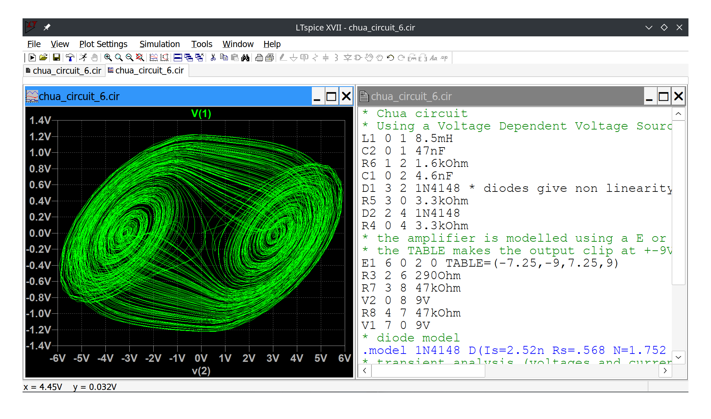

# LTspice_analog_circuit_simulation

Files for use with the analog circuit simulation tool LTspice

## chua_circuit_6.cir

Chua circuit exhibiting chaotic behaviour.
Simulation using modern sofware but done old school using a text file containing the circuit description.
The ampifier is modelled using a coltage controlled voltage source source.

