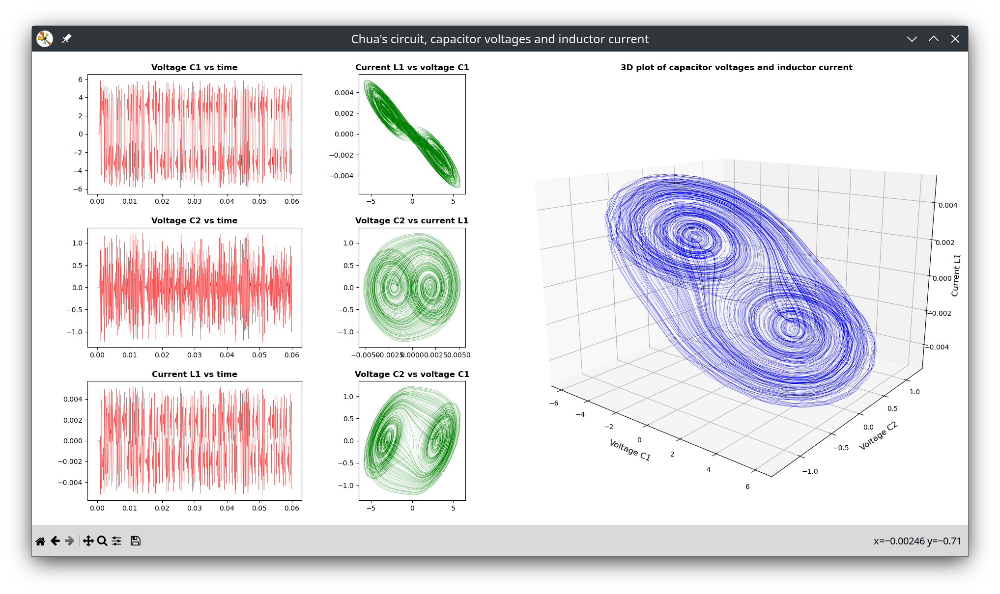

# LTspice_analog_circuit_simulation

Files for use with the analog circuit simulation tool LTspice

## chua_circuit_6.cir

Chua circuit exhibiting chaotic behaviour.
Simulation using modern sofware but done old school using a text file containing the circuit description.
The ampifier is modelled using a voltage controlled voltage source source.

## chua_circuit_6.txt

Data containing values for the voltages across the capacitors and current through the inductor of the Chua circuit. This file was generaed by the LTspice software.

## chua_circuit_plots_v2.py

A Python script which reads the data from chua_circuit_6.txt and generates several plots using the library Matplotlib. It also draws a 3D line plot of the 2 capacitor voltages and the inductor current.
